# URADI-360 Component Architecture Diagrams

**Version:** 1.0.0
**Date:** 2026-03-21
**Status:** ✅ COMPLETE

---

## Component Overview

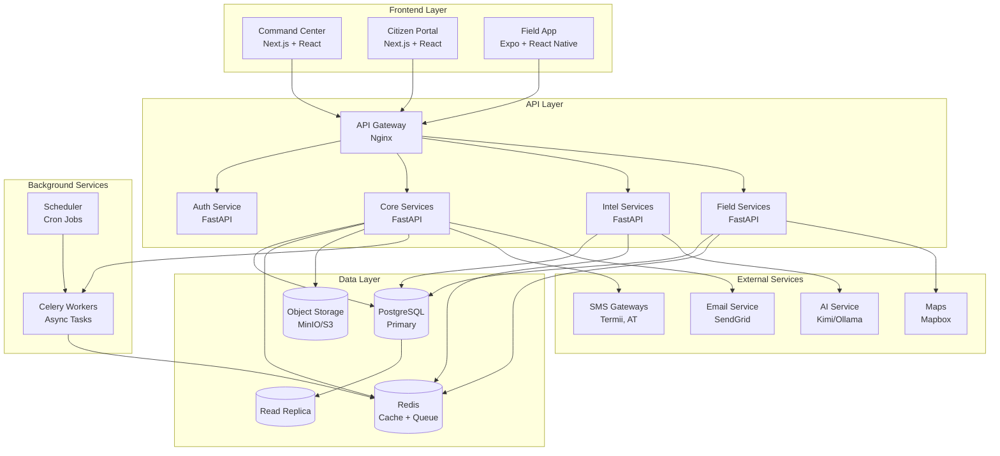
```mermaid
graph TB
    subgraph Clients["Frontend Layer"]
        CC[Command Center<br/>Next.js + React]
        CP[Citizen Portal<br/>Next.js + React]
        FA[Field App<br/>Expo + React Native]
    end

    subgraph APILayer["API Layer"]
        GW[API Gateway<br/>Nginx]
        AUTH[Auth Service<br/>FastAPI]
        CORE[Core Services<br/>FastAPI]
        INTEL[Intel Services<br/>FastAPI]
        FIELD[Field Services<br/>FastAPI]
    end

    subgraph DataLayer["Data Layer"]
        PG[(PostgreSQL<br/>Primary)]
        RR[(Read Replica)]
        REDIS[(Redis<br/>Cache + Queue)]
        S3[(Object Storage<br/>MinIO/S3)]
    end

    subgraph Background["Background Services"]
        CELERY[Celery Workers<br/>Async Tasks]
        SCHEDULER[Scheduler<br/>Cron Jobs]
    end

    subgraph External["External Services"]
        SMS[SMS Gateways<br/>Termii, AT]
        EMAIL[Email Service<br/>SendGrid]
        AI[AI Service<br/>Kimi/Ollama]
        MAPS[Maps<br/>Mapbox]
    end

    CC --> GW
    CP --> GW
    FA --> GW

    GW --> AUTH
    GW --> CORE
    GW --> INTEL
    GW --> FIELD

    CORE --> PG
    CORE --> REDIS
    CORE --> S3

    INTEL --> PG
    INTEL --> REDIS

    FIELD --> PG
    FIELD --> REDIS

    PG --> RR

    CORE --> CELERY
    CELERY --> REDIS
    SCHEDULER --> CELERY

    CORE --> SMS
    CORE --> EMAIL
    INTEL --> AI
    FIELD --> MAPS
```

---

## Detailed Component Breakdown

### 1. Frontend Layer

#### 1.1 Command Center (Admin Dashboard)

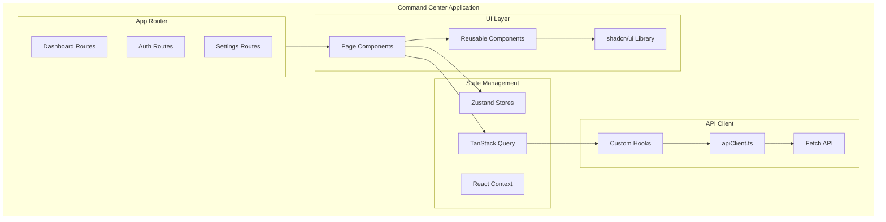
```mermaid
graph TD
    subgraph CommandCenter["Command Center Application"]
        subgraph UI["UI Layer"]
            PAGES[Page Components]
            COMP[Reusable Components]
            UI_LIB[shadcn/ui Library]
        end

        subgraph STATE["State Management"]
            ZUSTAND[Zustand Stores]
            RQ[TanStack Query]
            CONTEXT[React Context]
        end

        subgraph API_CLIENT["API Client"]
            FETCH[Fetch API]
            CLIENT[apiClient.ts]
            HOOKS[Custom Hooks]
        end

        subgraph ROUTES["App Router"]
            DASH[Dashboard Routes]
            AUTH[Auth Routes]
            SETTINGS[Settings Routes]
        end
    end

    PAGES --> COMP
    COMP --> UI_LIB
    PAGES --> ZUSTAND
    PAGES --> RQ
    RQ --> HOOKS
    HOOKS --> CLIENT
    CLIENT --> FETCH
    ROUTES --> PAGES
```

**Components:**

| Component | Technology | Responsibility |
|-----------|------------|----------------|
| **Page Components** | Next.js Pages | Route-level components |
| **UI Components** | React + Tailwind | Reusable UI elements |
| **shadcn/ui** | Radix UI + Tailwind | Design system components |
| **Zustand** | State Management | Global state (auth, tenant) |
| **TanStack Query** | Server State | API data caching |
| **apiClient** | TypeScript | HTTP client with interceptors |

#### 1.2 Component Hierarchy

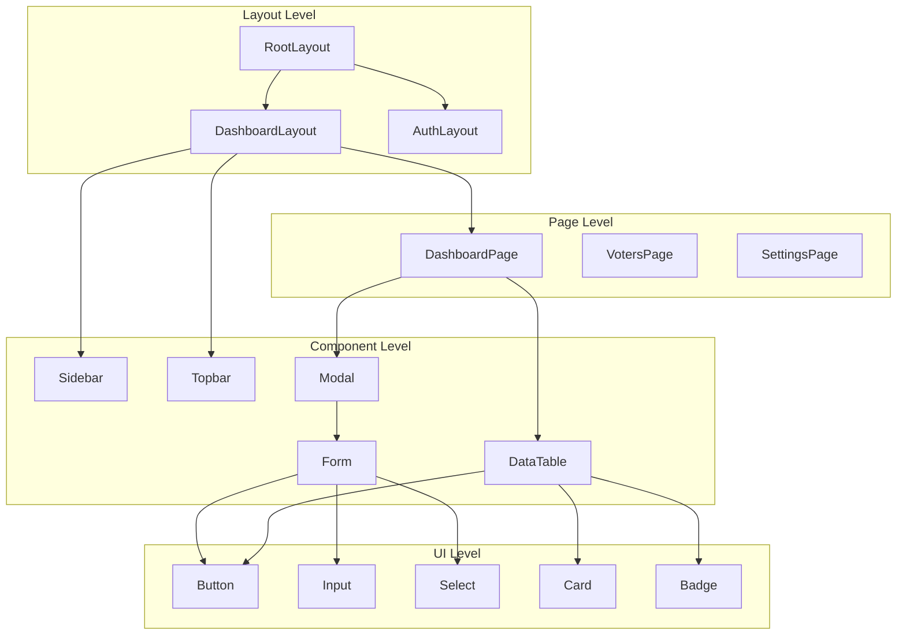
```mermaid
graph TD
    subgraph PageLevel["Page Level"]
        DASH_PAGE[DashboardPage]
        VOTERS_PAGE[VotersPage]
        SETTINGS_PAGE[SettingsPage]
    end

    subgraph LayoutLevel["Layout Level"]
        ROOT_LAYOUT[RootLayout]
        DASH_LAYOUT[DashboardLayout]
        AUTH_LAYOUT[AuthLayout]
    end

    subgraph ComponentLevel["Component Level"]
        SIDEBAR[Sidebar]
        TOPBAR[Topbar]
        TABLE[DataTable]
        MODAL[Modal]
        FORM[Form]
    end

    subgraph UILevel["UI Level"]
        BUTTON[Button]
        INPUT[Input]
        SELECT[Select]
        CARD[Card]
        BADGE[Badge]
    end

    ROOT_LAYOUT --> DASH_LAYOUT
    ROOT_LAYOUT --> AUTH_LAYOUT
    DASH_LAYOUT --> SIDEBAR
    DASH_LAYOUT --> TOPBAR
    DASH_LAYOUT --> DASH_PAGE
    DASH_PAGE --> TABLE
    DASH_PAGE --> MODAL
    MODAL --> FORM
    FORM --> INPUT
    FORM --> SELECT
    FORM --> BUTTON
    TABLE --> CARD
    TABLE --> BADGE
    TABLE --> BUTTON
```

#### 1.3 State Management Flow

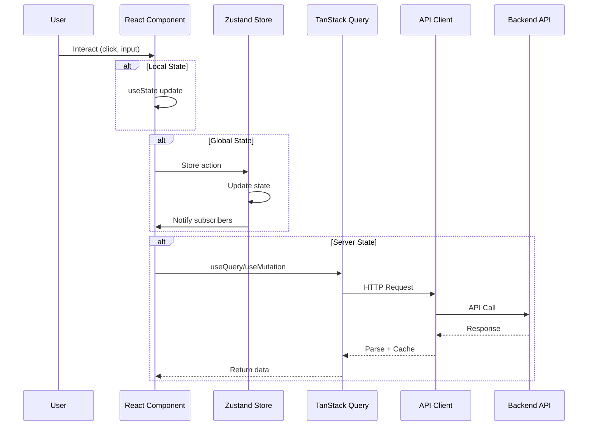
```mermaid
sequenceDiagram
    participant User
    participant Component as React Component
    participant Zustand as Zustand Store
    participant Query as TanStack Query
    participant API as API Client
    participant Backend as Backend API

    User->>Component: Interact (click, input)

    alt Local State
        Component->>Component: useState update
    end

    alt Global State
        Component->>Zustand: Store action
        Zustand->>Zustand: Update state
        Zustand->>Component: Notify subscribers
    end

    alt Server State
        Component->>Query: useQuery/useMutation
        Query->>API: HTTP Request
        API->>Backend: API Call
        Backend-->>API: Response
        API-->>Query: Parse + Cache
        Query-->>Component: Return data
    end
```

### 2. Backend Layer

#### 2.1 Service Architecture

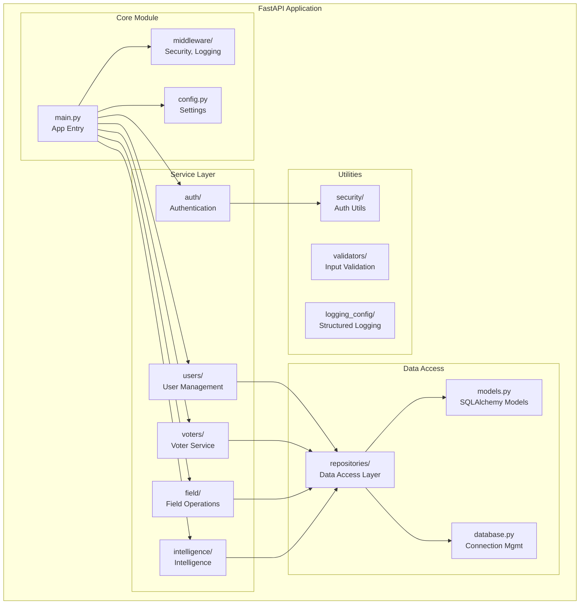
```mermaid
graph TB
    subgraph APILayer["FastAPI Application"]
        subgraph Core["Core Module"]
            MAIN[main.py<br/>App Entry]
            CONFIG[config.py<br/>Settings]
            MIDDLEWARE[middleware/<br/>Security, Logging]
        end

        subgraph Services["Service Layer"]
            AUTH_SVC[auth/<br/>Authentication]
            USER_SVC[users/<br/>User Management]
            VOTER_SVC[voters/<br/>Voter Service]
            FIELD_SVC[field/<br/>Field Operations]
            INTEL_SVC[intelligence/<br/>Intelligence]
        end

        subgraph DataAccess["Data Access"]
            MODELS[models.py<br/>SQLAlchemy Models]
            DATABASE[database.py<br/>Connection Mgmt]
            REPOS[repositories/<br/>Data Access Layer]
        end

        subgraph Utils["Utilities"]
            SECURITY[security/<br/>Auth Utils]
            VALIDATION[validators/<br/>Input Validation]
            LOGGING[logging_config/<br/>Structured Logging]
        end
    end

    MAIN --> AUTH_SVC
    MAIN --> USER_SVC
    MAIN --> VOTER_SVC
    MAIN --> FIELD_SVC
    MAIN --> INTEL_SVC

    AUTH_SVC --> SECURITY
    USER_SVC --> REPOS
    VOTER_SVC --> REPOS
    FIELD_SVC --> REPOS
    INTEL_SVC --> REPOS

    REPOS --> MODELS
    REPOS --> DATABASE

    MAIN --> MIDDLEWARE
    MAIN --> CONFIG
```

#### 2.2 Request Processing Flow

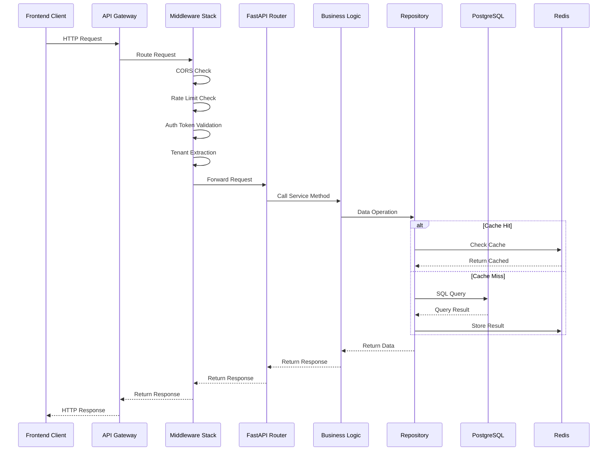
```mermaid
sequenceDiagram
    participant Client as Frontend Client
    participant Gateway as API Gateway
    participant Middleware as Middleware Stack
    participant Router as FastAPI Router
    participant Service as Business Logic
    participant Repository as Repository
    participant DB as PostgreSQL
    participant Cache as Redis

    Client->>Gateway: HTTP Request
    Gateway->>Middleware: Route Request

    Middleware->>Middleware: CORS Check
    Middleware->>Middleware: Rate Limit Check
    Middleware->>Middleware: Auth Token Validation
    Middleware->>Middleware: Tenant Extraction

    Middleware->>Router: Forward Request
    Router->>Service: Call Service Method

    Service->>Repository: Data Operation

    alt Cache Hit
        Repository->>Cache: Check Cache
        Cache-->>Repository: Return Cached
    else Cache Miss
        Repository->>DB: SQL Query
        DB-->>Repository: Query Result
        Repository->>Cache: Store Result
    end

    Repository-->>Service: Return Data
    Service-->>Router: Return Response
    Router-->>Middleware: Return Response
    Middleware-->>Gateway: Return Response
    Gateway-->>Client: HTTP Response
```

#### 2.3 Authentication Flow

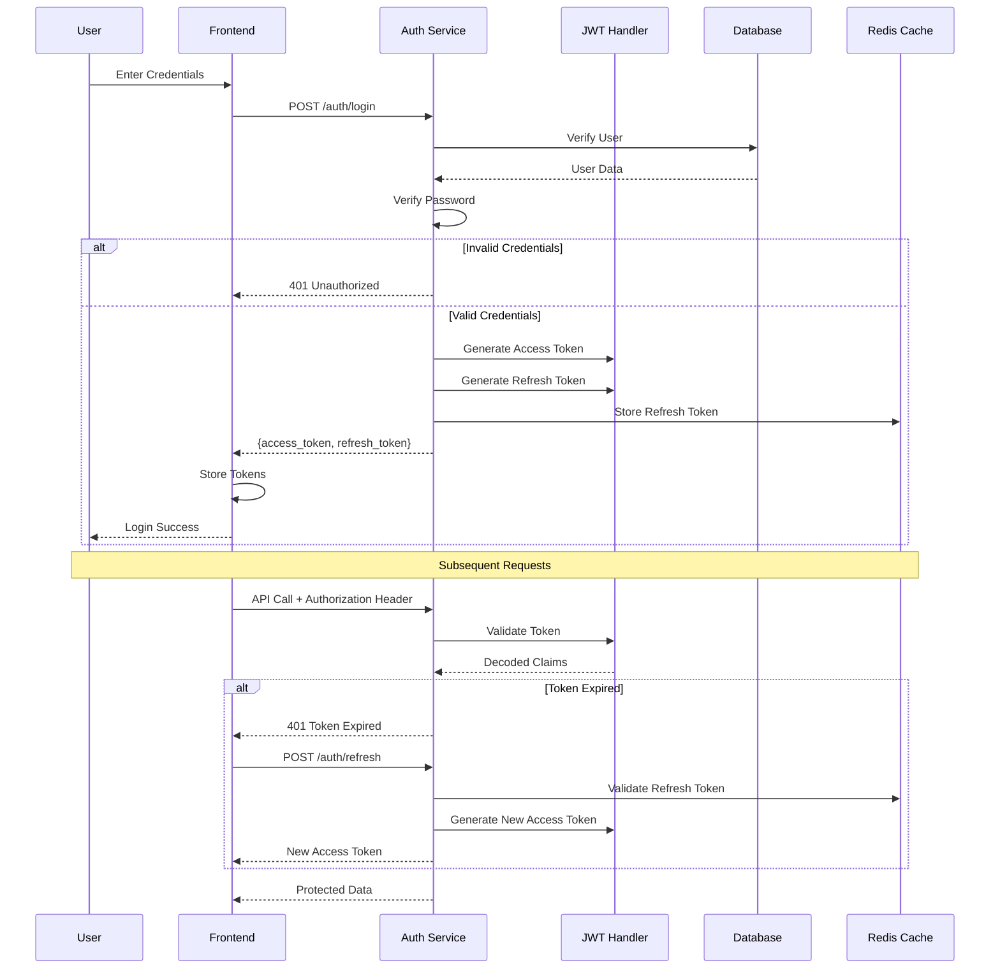
```mermaid
sequenceDiagram
    participant User as User
    participant Client as Frontend
    participant AuthService as Auth Service
    participant JWT as JWT Handler
    participant DB as Database
    participant Redis as Redis Cache

    User->>Client: Enter Credentials
    Client->>AuthService: POST /auth/login

    AuthService->>DB: Verify User
    DB-->>AuthService: User Data

    AuthService->>AuthService: Verify Password

    alt Invalid Credentials
        AuthService-->>Client: 401 Unauthorized
    else Valid Credentials
        AuthService->>JWT: Generate Access Token
        AuthService->>JWT: Generate Refresh Token

        AuthService->>Redis: Store Refresh Token

        AuthService-->>Client: {access_token, refresh_token}
        Client->>Client: Store Tokens

        Client-->>User: Login Success
    end

    Note over User,Redis: Subsequent Requests

    Client->>AuthService: API Call + Authorization Header
    AuthService->>JWT: Validate Token
    JWT-->>AuthService: Decoded Claims

    alt Token Expired
        AuthService-->>Client: 401 Token Expired
        Client->>AuthService: POST /auth/refresh
        AuthService->>Redis: Validate Refresh Token
        AuthService->>JWT: Generate New Access Token
        AuthService-->>Client: New Access Token
    end

    AuthService-->>Client: Protected Data
```

### 3. Database Layer

#### 3.1 Entity Relationship Diagram

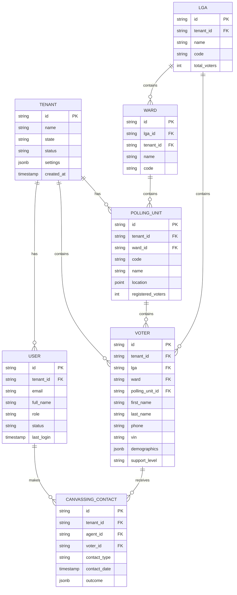
```mermaid
erDiagram
    TENANT ||--o{ USER : has
    TENANT ||--o{ VOTER : contains
    TENANT ||--o{ POLLING_UNIT : has
    USER ||--o{ CANVASSING_CONTACT : makes
    VOTER ||--o{ CANVASSING_CONTACT : receives
    POLLING_UNIT ||--o{ VOTER : contains
    LGA ||--o{ WARD : contains
    WARD ||--o{ POLLING_UNIT : contains
    LGA ||--o{ VOTER : contains

    TENANT {
        string id PK
        string name
        string state
        string status
        jsonb settings
        timestamp created_at
    }

    USER {
        string id PK
        string tenant_id FK
        string email
        string full_name
        string role
        string status
        timestamp last_login
    }

    VOTER {
        string id PK
        string tenant_id FK
        string lga FK
        string ward FK
        string polling_unit_id FK
        string first_name
        string last_name
        string phone
        string vin
        jsonb demographics
        string support_level
    }

    POLLING_UNIT {
        string id PK
        string tenant_id FK
        string ward_id FK
        string code
        string name
        point location
        int registered_voters
    }

    CANVASSING_CONTACT {
        string id PK
        string tenant_id FK
        string agent_id FK
        string voter_id FK
        string contact_type
        timestamp contact_date
        jsonb outcome
    }

    LGA {
        string id PK
        string tenant_id FK
        string name
        string code
        int total_voters
    }

    WARD {
        string id PK
        string lga_id FK
        string tenant_id FK
        string name
        string code
    }
```

#### 3.2 Multi-Tenant Data Isolation

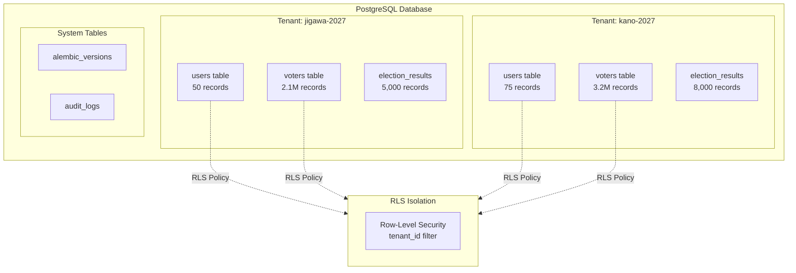
```mermaid
graph TB
    subgraph Database["PostgreSQL Database"]
        subgraph TenantA["Tenant: jigawa-2027"]
            A_USERS[users table<br/>50 records]
            A_VOTERS[voters table<br/>2.1M records]
            A_RESULTS[election_results<br/>5,000 records]
        end

        subgraph TenantB["Tenant: kano-2027"]
            B_USERS[users table<br/>75 records]
            B_VOTERS[voters table<br/>3.2M records]
            B_RESULTS[election_results<br/>8,000 records]
        end

        subgraph System["System Tables"]
            MIGRATIONS[alembic_versions]
            AUDIT[audit_logs]
        end
    end

    subgraph Isolation["RLS Isolation"]
        POLICY[Row-Level Security<br/>tenant_id filter]
    end

    A_USERS -.->|RLS Policy| Isolation
    A_VOTERS -.->|RLS Policy| Isolation
    B_USERS -.->|RLS Policy| Isolation
    B_VOTERS -.->|RLS Policy| Isolation
```

### 4. Background Services

#### 4.1 Celery Task Flow

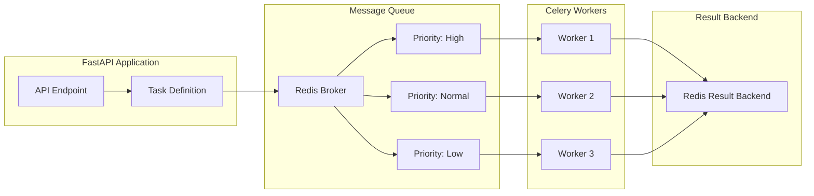
```mermaid
graph LR
    subgraph API["FastAPI Application"]
        ENDPOINT[API Endpoint]
        TASK_DEF[Task Definition]
    end

    subgraph Queue["Message Queue"]
        REDIS_BROKER[Redis Broker]
        QUEUE_HIGH[Priority: High]
        QUEUE_NORMAL[Priority: Normal]
        QUEUE_LOW[Priority: Low]
    end

    subgraph Workers["Celery Workers"]
        WORKER1[Worker 1]
        WORKER2[Worker 2]
        WORKER3[Worker 3]
    end

    subgraph Results["Result Backend"]
        REDIS_RESULT[Redis Result Backend]
    end

    ENDPOINT --> TASK_DEF
    TASK_DEF --> REDIS_BROKER
    REDIS_BROKER --> QUEUE_HIGH
    REDIS_BROKER --> QUEUE_NORMAL
    REDIS_BROKER --> QUEUE_LOW

    QUEUE_HIGH --> WORKER1
    QUEUE_NORMAL --> WORKER2
    QUEUE_LOW --> WORKER3

    WORKER1 --> REDIS_RESULT
    WORKER2 --> REDIS_RESULT
    WORKER3 --> REDIS_RESULT
```

#### 4.2 Scheduled Tasks

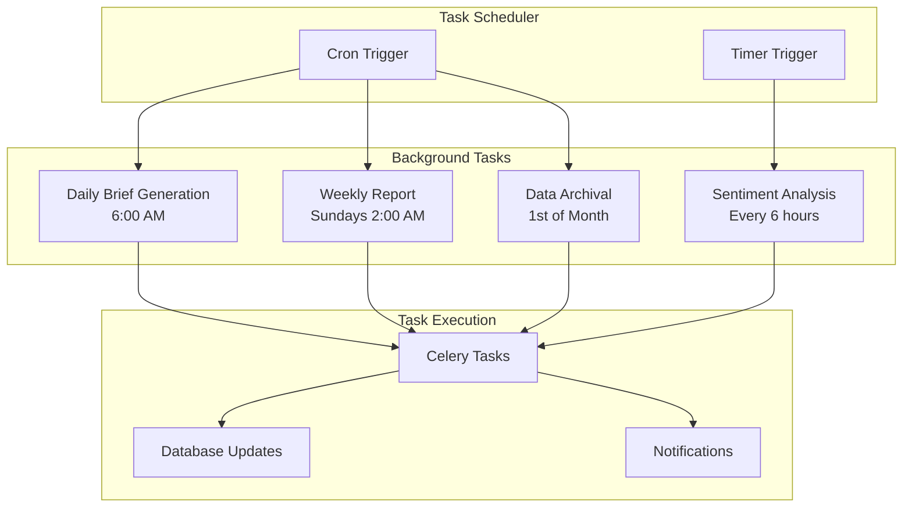
```mermaid
graph TB
    subgraph Scheduler["Task Scheduler"]
        CRON[Cron Trigger]
        TIMER[Timer Trigger]
    end

    subgraph Tasks["Background Tasks"]
        DAILY_BRIEF[Daily Brief Generation<br/>6:00 AM]
        SENTIMENT[Sentiment Analysis<br/>Every 6 hours]
        WEEKLY_REPORT[Weekly Report<br/>Sundays 2:00 AM]
        DATA_ARCHIVE[Data Archival<br/>1st of Month]
    end

    subgraph Execution["Task Execution"]
        CELERY_TASKS[Celery Tasks]
        DB_UPDATE[Database Updates]
        NOTIFICATIONS[Notifications]
    end

    CRON --> DAILY_BRIEF
    CRON --> WEEKLY_REPORT
    CRON --> DATA_ARCHIVE
    TIMER --> SENTIMENT

    DAILY_BRIEF --> CELERY_TASKS
    SENTIMENT --> CELERY_TASKS
    WEEKLY_REPORT --> CELERY_TASKS
    DATA_ARCHIVE --> CELERY_TASKS

    CELERY_TASKS --> DB_UPDATE
    CELERY_TASKS --> NOTIFICATIONS
```

### 5. External Integrations

#### 5.1 Communication Services

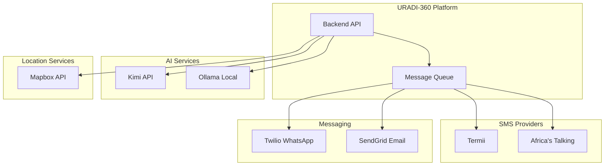
```mermaid
graph TB
    subgraph Platform["URADI-360 Platform"]
        API[Backend API]
        QUEUE[Message Queue]
    end

    subgraph SMS["SMS Providers"]
        TERMII[Termii]
        AT[Africa's Talking]
    end

    subgraph Messaging["Messaging"]
        TWILIO[Twilio WhatsApp]
        SENDGRID[SendGrid Email]
    end

    subgraph AI["AI Services"]
        KIMI[Kimi API]
        OLLAMA[Ollama Local]
    end

    subgraph Maps["Location Services"]
        MAPBOX[Mapbox API]
    end

    API --> QUEUE

    QUEUE --> TERMII
    QUEUE --> AT
    QUEUE --> TWILIO
    QUEUE --> SENDGRID

    API --> KIMI
    API --> OLLAMA
    API --> MAPBOX
```

#### 5.2 Integration Flow

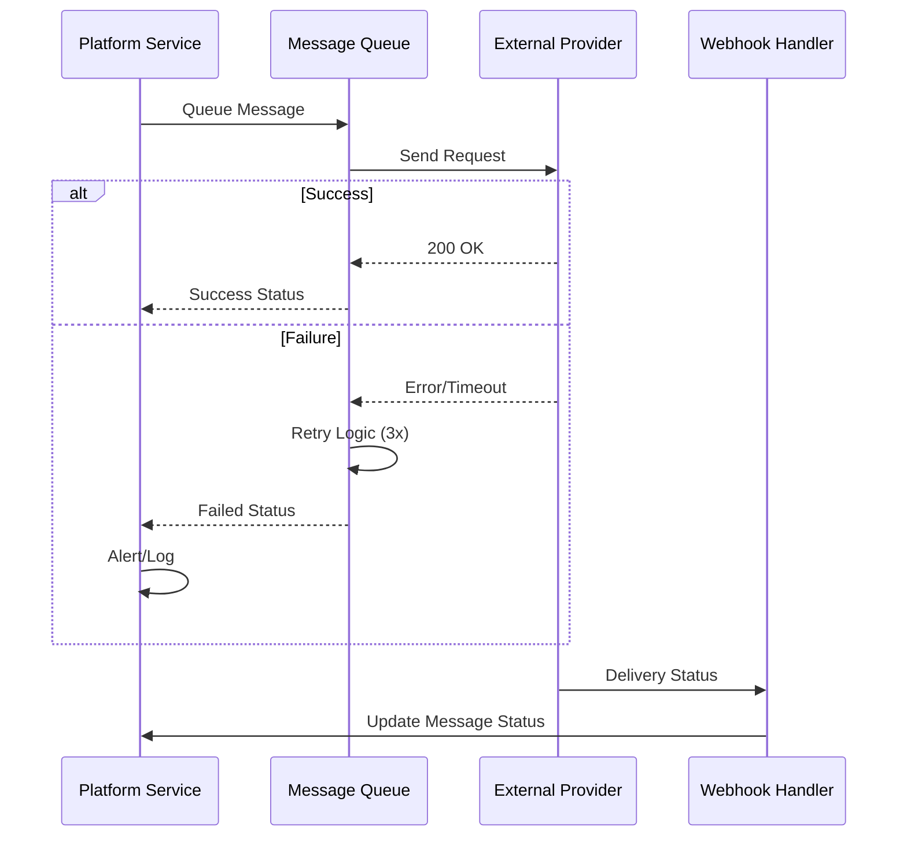
```mermaid
sequenceDiagram
    participant Service as Platform Service
    participant Queue as Message Queue
    participant Provider as External Provider
    participant Webhook as Webhook Handler

    Service->>Queue: Queue Message
    Queue->>Provider: Send Request

    alt Success
        Provider-->>Queue: 200 OK
        Queue-->>Service: Success Status
    else Failure
        Provider-->>Queue: Error/Timeout
        Queue->>Queue: Retry Logic (3x)
        Queue-->>Service: Failed Status
        Service->>Service: Alert/Log
    end

    Provider->>Webhook: Delivery Status
    Webhook->>Service: Update Message Status
```

---

## Deployment Architecture

### Infrastructure Diagram

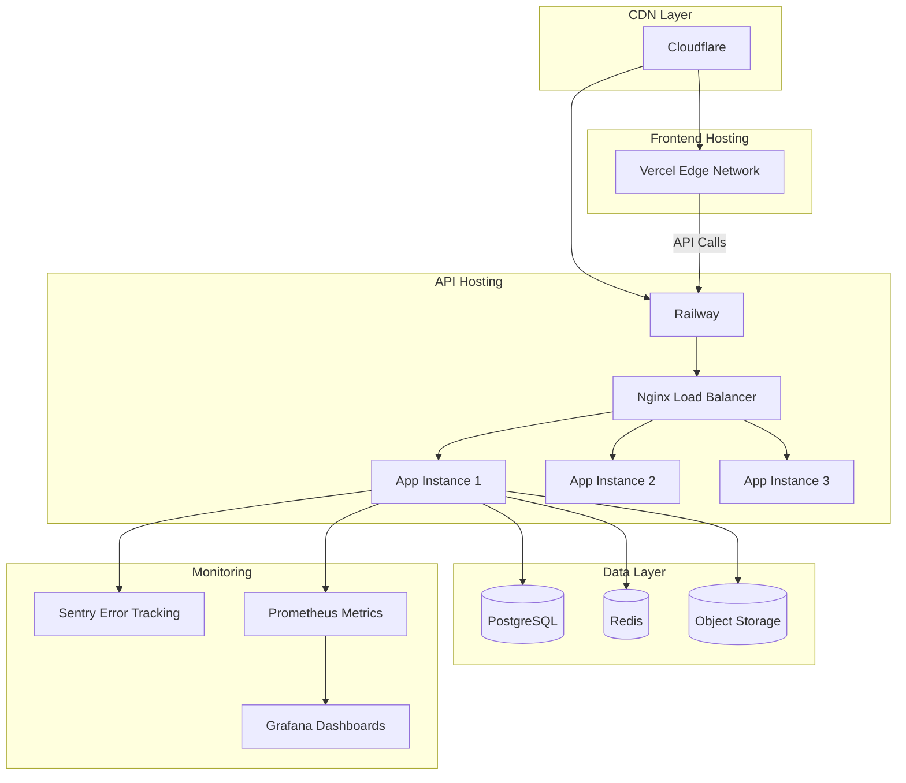
```mermaid
graph TB
    subgraph CDN["CDN Layer"]
        CLOUDFLARE[Cloudflare]
    end

    subgraph Frontend["Frontend Hosting"]
        VERCEL[Vercel Edge Network]
    end

    subgraph API["API Hosting"]
        RAILWAY[Railway]
        NGINX[Nginx Load Balancer]
        APP1[App Instance 1]
        APP2[App Instance 2]
        APP3[App Instance 3]
    end

    subgraph Data["Data Layer"]
        PG[(PostgreSQL)]
        REDIS[(Redis)]
        S3[(Object Storage)]
    end

    subgraph Monitoring["Monitoring"]
        SENTRY[Sentry Error Tracking]
        PROMETHEUS[Prometheus Metrics]
        GRAFANA[Grafana Dashboards]
    end

    CLOUDFLARE --> VERCEL
    CLOUDFLARE --> RAILWAY

    VERCEL -->|API Calls| RAILWAY

    RAILWAY --> NGINX
    NGINX --> APP1
    NGINX --> APP2
    NGINX --> APP3

    APP1 --> PG
    APP1 --> REDIS
    APP1 --> S3

    APP1 --> SENTRY
    APP1 --> PROMETHEUS
    PROMETHEUS --> GRAFANA
```

### Network Topology

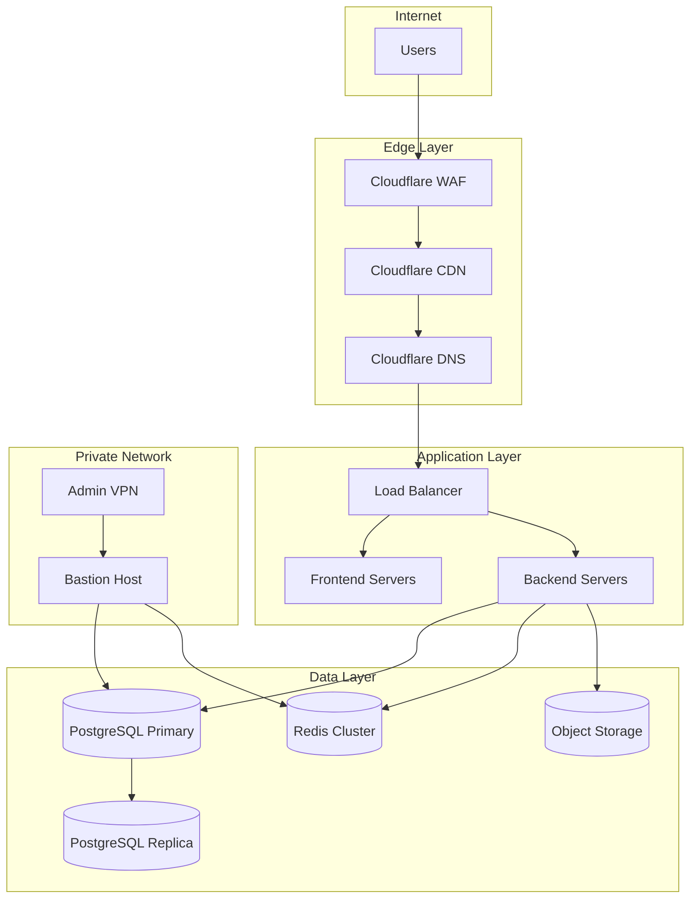
```mermaid
graph TB
    subgraph Internet["Internet"]
        USERS[Users]
    end

    subgraph Edge["Edge Layer"]
        WAF[Cloudflare WAF]
        DNS[Cloudflare DNS]
        CDN[Cloudflare CDN]
    end

    subgraph AppLayer["Application Layer"]
        LB[Load Balancer]
        FE[Frontend Servers]
        BE[Backend Servers]
    end

    subgraph DataLayer["Data Layer"]
        DB_PRIMARY[(PostgreSQL Primary)]
        DB_REPLICA[(PostgreSQL Replica)]
        CACHE[(Redis Cluster)]
        STORE[(Object Storage)]
    end

    subgraph Private["Private Network"]
        VPN[Admin VPN]
        JUMP[Bastion Host]
    end

    USERS --> WAF
    WAF --> CDN
    CDN --> DNS
    DNS --> LB
    LB --> FE
    LB --> BE

    BE --> DB_PRIMARY
    DB_PRIMARY --> DB_REPLICA
    BE --> CACHE
    BE --> STORE

    VPN --> JUMP
    JUMP --> DB_PRIMARY
    JUMP --> CACHE
```

---

## Security Architecture

### Defense in Depth

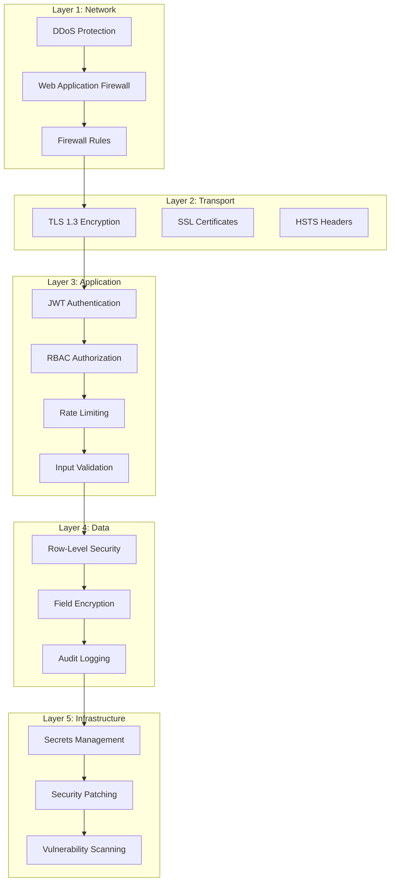
```mermaid
graph TB
    subgraph Layer1["Layer 1: Network"]
        FIREWALL[Firewall Rules]
        DDoS[DDoS Protection]
        WAF_SEC[Web Application Firewall]
    end

    subgraph Layer2["Layer 2: Transport"]
        TLS[TLS 1.3 Encryption]
        CERT[SSL Certificates]
        HSTS[HSTS Headers]
    end

    subgraph Layer3["Layer 3: Application"]
        AUTH_SEC[JWT Authentication]
        RBAC_SEC[RBAC Authorization]
        RATE[Rate Limiting]
        INPUT[Input Validation]
    end

    subgraph Layer4["Layer 4: Data"]
        RLS_SEC[Row-Level Security]
        ENCRYPT[Field Encryption]
        AUDIT_SEC[Audit Logging]
    end

    subgraph Layer5["Layer 5: Infrastructure"]
        SECRETS[Secrets Management]
        PATCH[Security Patching]
        SCAN[Vulnerability Scanning]
    end

    DDoS --> WAF_SEC
    WAF_SEC --> FIREWALL
    FIREWALL --> TLS
    TLS --> AUTH_SEC
    AUTH_SEC --> RBAC_SEC
    RBAC_SEC --> RATE
    RATE --> INPUT
    INPUT --> RLS_SEC
    RLS_SEC --> ENCRYPT
    ENCRYPT --> AUDIT_SEC
    AUDIT_SEC --> SECRETS
    SECRETS --> PATCH
    PATCH --> SCAN
```

---

## Data Flow Patterns

### Pattern 1: Command-Query Separation

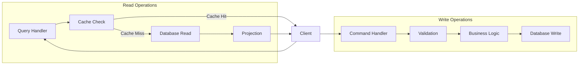
```mermaid
graph LR
    subgraph Write["Write Operations"]
        COMMAND[Command Handler]
        VALIDATE[Validation]
        BUSINESS[Business Logic]
        DB_WRITE[Database Write]
    end

    subgraph Read["Read Operations"]
        QUERY[Query Handler]
        CACHE_READ[Cache Check]
        DB_READ[Database Read]
        PROJECTION[Projection]
    end

    Client --> COMMAND
    COMMAND --> VALIDATE
    VALIDATE --> BUSINESS
    BUSINESS --> DB_WRITE

    Client --> QUERY
    QUERY --> CACHE_READ
    CACHE_READ -->|Cache Miss| DB_READ
    DB_READ --> PROJECTION
    CACHE_READ -->|Cache Hit| Client
    PROJECTION --> Client
```

### Pattern 2: Event Sourcing (Audit Trail)

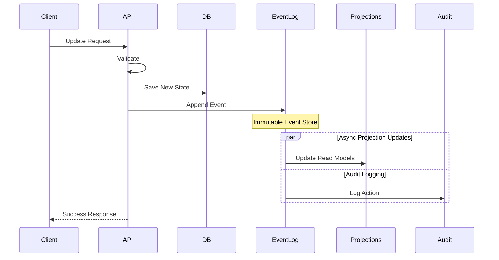
```mermaid
sequenceDiagram
    participant Client
    participant API
    participant DB
    participant EventLog
    participant Projections

    Client->>API: Update Request
    API->>API: Validate
    API->>DB: Save New State
    API->>EventLog: Append Event
    Note over EventLog: Immutable Event Store

    par Async Projection Updates
        EventLog->>Projections: Update Read Models
    and Audit Logging
        EventLog->>Audit: Log Action
    end

    API-->>Client: Success Response
```

---

## Scalability Patterns

### Horizontal Scaling

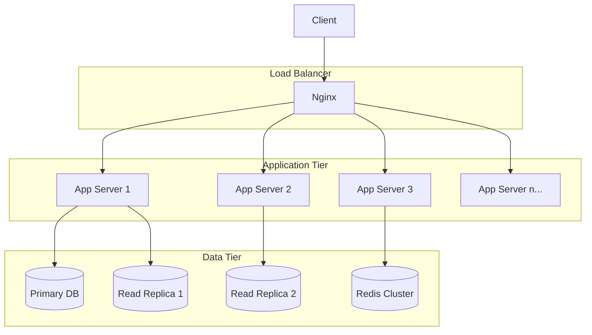
```mermaid
graph TB
    subgraph LoadBalancer["Load Balancer"]
        NGINX_LB[Nginx]
    end

    subgraph AppTier["Application Tier"]
        APP1[App Server 1]
        APP2[App Server 2]
        APP3[App Server 3]
        APPn[App Server n...]
    end

    subgraph DataTier["Data Tier"]
        MASTER[(Primary DB)]
        REPLICA1[(Read Replica 1)]
        REPLICA2[(Read Replica 2)]
        CACHE[(Redis Cluster)]
    end

    Client --> NGINX_LB
    NGINX_LB --> APP1
    NGINX_LB --> APP2
    NGINX_LB --> APP3
    NGINX_LB --> APPn

    APP1 --> MASTER
    APP1 --> REPLICA1
    APP2 --> REPLICA2
    APP3 --> CACHE
```

---

**Document Version:** 1.0.0
**Last Updated:** 2026-03-21
**Maintained by:** Technical Architecture Team
